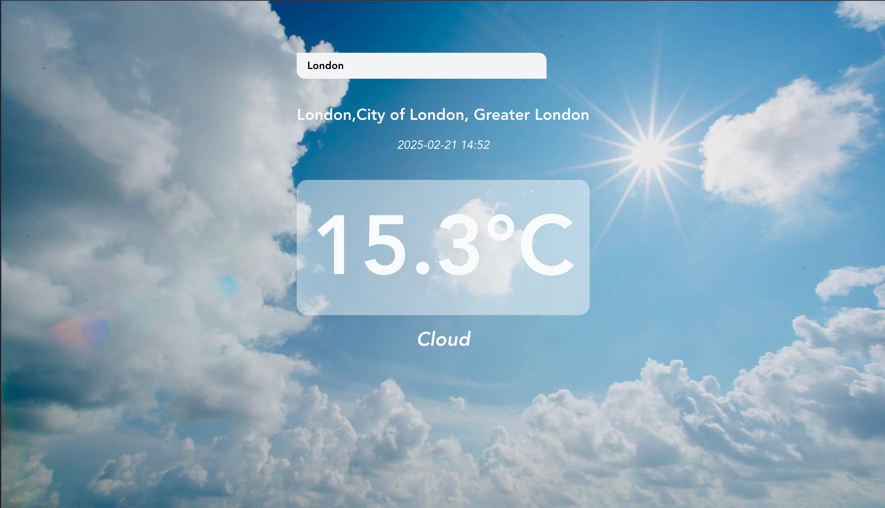

# Weather App

A responsive weather application built with Vue.js that provides real-time weather information. The app allows users to search for weather conditions in any location by simply entering a country or city name.

## Features

- **Real-time Weather Data**: Fetches current weather information from WeatherAPI.com
- **Location Search**: Search weather by country or city name
- **Detailed Weather Information**: Displays temperature, current date and time, and weather conditions (cloudy, raining, etc.)
- **Responsive Design**: Works on desktop and mobile devices

## Screenshots




## Tech Stack

- **Frontend Framework**: Vue.js
- **Build Tool**: Vue CLI
- **API**: WeatherAPI.com

## Project Setup

```
npm install
```

### Compiles and Hot-reloads for Development

```
npm run serve
```

### Compiles and Minifies for Production

```
npm run build
```

### Lints and Fixes Files

```
npm run lint
```

## API Configuration

This application uses the [WeatherAPI.com](https://www.weatherapi.com/) service. To run the application:

1. Sign up for a free API key at WeatherAPI.com
2. Create a `.env` file in the root directory
3. Add your API key: `VUE_APP_API_KEY=your_api_key_here`

## Usage

1. Launch the application using `npm run serve`
2. Enter a country or city name in the search field
3. View the current weather conditions including:
   - Current temperature
   - Local date and time
   - Weather condition (sunny, cloudy, raining, etc.)
   - Additional weather details

## Contributing

Contributions are welcome! Please feel free to submit a Pull Request.

## Customize Configuration

See [Configuration Reference](https://cli.vuejs.org/config/) for Vue CLI configuration options.
